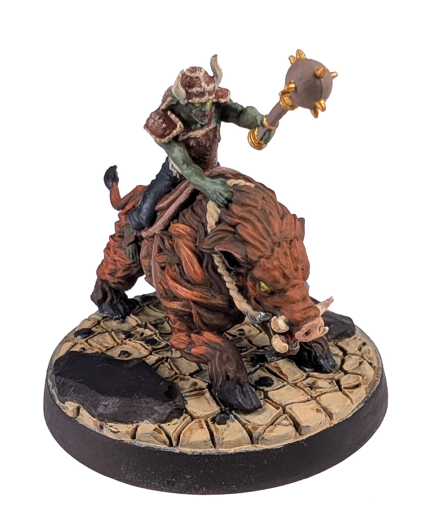
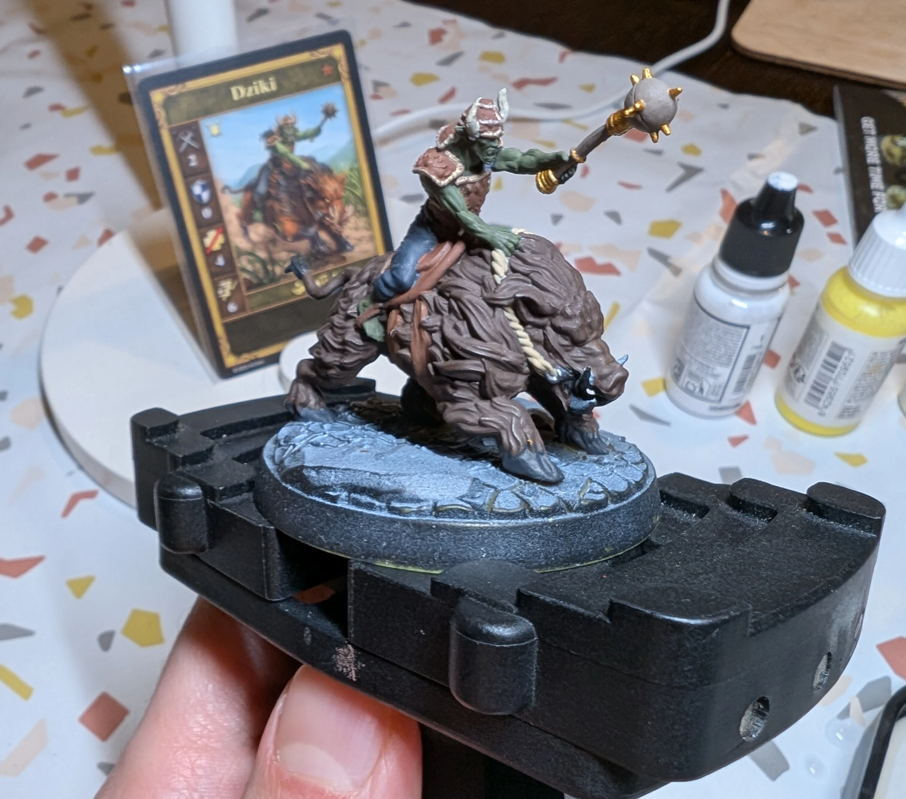

# Dzik
<small>Czytaj w innym języku: [:gb:](https://paint-h3.qwrtln.nl/posts/2025/02/boar/) [:ru:](https://ru.paint-h3.qwrtln.nl/posts/2025/02/боров/)</small>

Moja pierwsza figurka z dużą, 5-centymetrową podstawką. Ciągle wpadałem w pułapkę "jeszcze tylko jedno pociągnięcie pędzlem".

  

<!--more-->

  

    
  

  

    
  

Kliknij, aby zobaczyć wideo z rozpakowywania

  <video width="1280" height="720" controls preload="none">
    <source src="/assets/videos/boar.webm" type="video/webm">
  </video>

Zobacz Dziki na [Wiki](https://homm3bg.wiki/pl/units/boars) (rym Brzechwy godzien).

Pomimo moich starań, odwzorowanie oryginalnych kolorów okazało się omal niemożliwe, szczególnie w przypadku sierści zwierzęcia. Trzeba opanować technikę dry-brush na prostszych modelach, zanim podejmie się próbę malowania bardziej okazałych stworów, takich jak smoki.

### Proces

Zacząłem od kolorów bazowych (pomijając niektóre detale, jak dzika [*bardzo ostre*] kły) bez planowania całego procesu.

/// caption
Kolory bazowe z widocznym zenitalnym podkładem na podstawce
///

Celowo zrobiłem ciemną sierść (brąz + czerń), aby stworzyć kontrast z rudawymi rozjaśnieniami dodanymi później. Po pierwszych próbach zrezygnowałem z czarnych pasemek, ponieważ efekty były mało zadowalające. Druga warstwa została pomalowana mieszanką pomarańczowego i brązowego, aby dopasować się do koloru z karty, a końcowe rozjaśnienia zostały nałożone techniką dry-brush czystym pomarańczowym.

Pozostały jeszcze szczegóły mordy bestii i twarzy jeźdźca, odpowiednie rozjaśnienia skóry goblina, krawędzie siodła oraz detale zbroi. Przy tak wielu podobnych kolorach, wybór odpowiedniej palety był wyzwaniem.

Podstawka jest pomalowana pustynnym beżem (desert tan) z Agrax Earthshade w zagłębieniach. Kamienie są pomalowane mieszanką czarnego z odrobiną niebieskiego dla uzyskania lekko szarego wyglądu.

### Wniosek

Powinienem robić nieco mocniejsze rozjaśnienia. Poza tym rozróżnienie między podobnymi kolorami powinno być zaplanowane przed rozpoczęciem malowania.

A żona projektant to skarb - służy jako skuteczny łom kreatywności.
