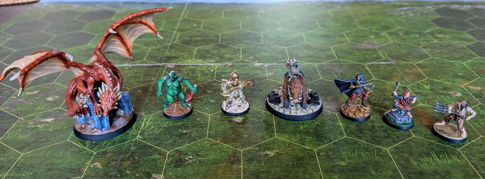

# Pierwsza Siódemka
<small>Czytaj w innym języku: [:gb:](https://paint-h3.qwrtln.nl/posts/2025/02/first-seven-minis/) [:ru:](https://ru.paint-h3.qwrtln.nl/posts/2025/02/первая-семерка/)</small>

Wnioski wyciągnięte z początku przygody.

/// caption
Nawet amatorskie malowanie jest lepsze niż goły plastik.
Aż chce się grać.
///

<!--more-->

Szybki rachunek: pomalowanie 7 figurek zajęło mi około 3 miesięcy. W tym tempie pomalowanie całej gry zajmie około 3 lat. Zobaczmy, czy ta prognoza się sprawdzi.

Najważniejsze wnioski:

 - Ten rodzaj artyzmu rządzi się konkretnymi zasadami, których każdy może się nauczyć, a przestrzeganie ich prowadzi do przyzwoitych rezultatów.

 - Nie ma co przejmować się szczegółami czy jakością, dopóki sprawia ci to przyjemność.
 Czas płynie zaskakująco szybko, gdy skupiasz się całkowicie na malowaniu kolejnej figurki.

 - Internetowe tutoriale wideo mają ograniczoną wartość, chyba że pokazują malowanie czegoś bardzo podobnego do twojego projektu (jak dotąd znalazłem [jednego YouTubera](https://www.youtube.com/@olebrogger/search?query=heroes), który to robi).
 Większość twórców tutoriali używa wysokiej jakości figurek i sprzętu, które są dla mnie niedostępne albo nie chcę w nie inwestować.
 Oczywiście, ich tutoriale nie wyglądałyby tak spektakularnie, gdyby używali materiałów niższej jakości.

 - Dobrej jakości pędzel to najważniejszy element wyposażenia.
Wprawdzie na innych materiałach można oszczędzić, niemniej jednak kiepskiej jakości pędzel ograniczy twoje rezultaty.

 - Jeśli masz ścisły umysł i zaczynasz przygodę ze sztuką, to hobby pozytywnie pobudzi twój mózg.
Rozwiniesz umiejętności z tych obszarów, które zazwyczaj nie są zbyt aktywne.
Coś jak uczenie kreatywnego przyjaciela programowania, tyle że na odwrót.

Mam nadzieję, że pomogłem. Łap ten pędzel i zobacz, co z tego wyniknie.
