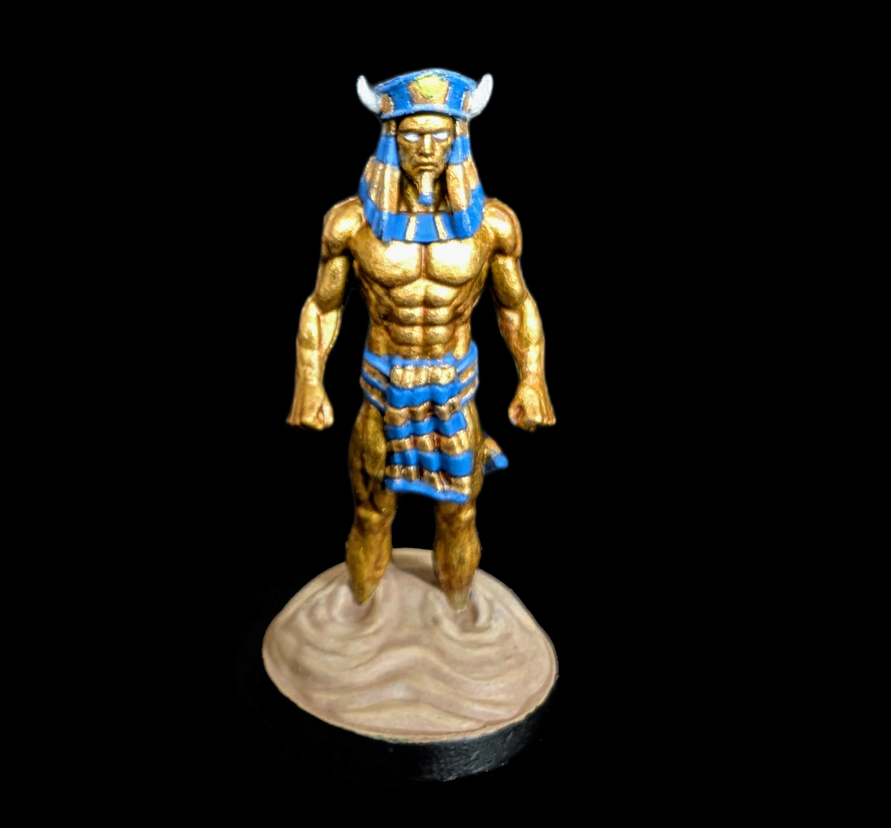
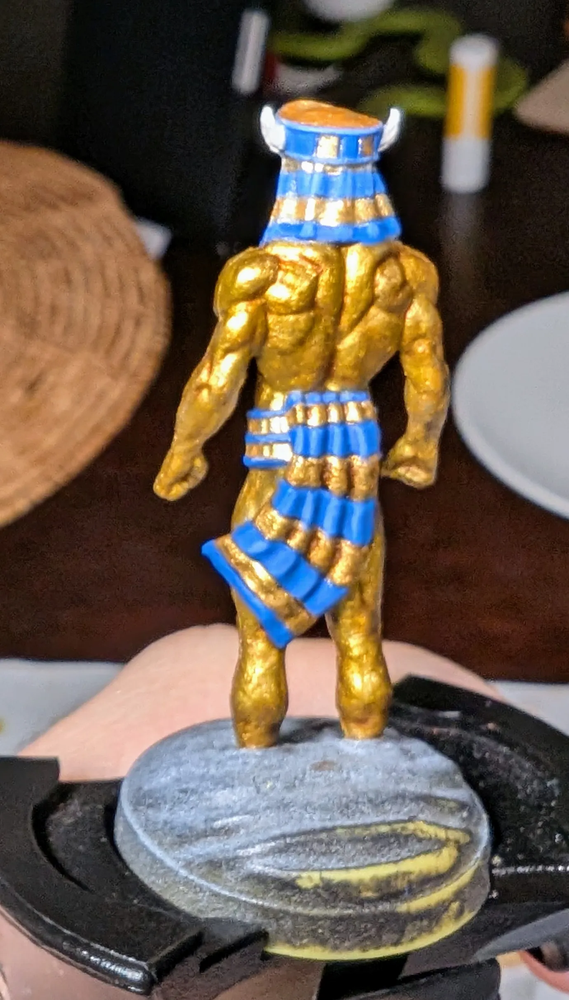

# Złoty Golem
<small>Czytaj w innym języku: [:gb:](https://paint-h3.qwrtln.nl/posts/2025/02/gold-golem/) [:ru:](https://ru.paint-h3.qwrtln.nl/posts/2025/02/золотой-голем/)</small>

Malowanie mięśni metalicznymi farbami jest bardzo satysfakcjonujące - złoto pięknie łapie światło i podkreśla wyrzeźbioną sylwetkę.

  

<!--more-->

  

    
  

  

    
    
  

Kliknij, aby zobaczyć wideo z rozpakowywania

  <video width="1280" height="720" controls preload="none">
    <source src="/assets/videos/gold-golem.webm" type="video/webm">
  </video>

### Plan

Większość figurki będzie pokryta metalicznymi farbami, które same w sobie błyszczą. Standardowy zenitalny podkład pomaga wydobyć wszystkie detale.

{width="400px"}
/// caption
Dłonie są zbyt blade, ale poza tym wszystkie detale są wyraźnie widoczne.
///

{width="400px"}
/// caption
Ten Faraon nigdy nie opuszczał dnia nóg.
///

### Proces

Zacząłem od pokrycia górnej części ciała starym złotem AK, następnie warstwą Reikland Fleshshade, aby przyciemnić zagłębienia. Na koniec warstwa złota Vallejo.

{width="400px"}
/// caption
Te proste czynności już sprawiają, że "skóra" golema wygląda dobrze.
///

{width="400px"}
/// caption
Dla porównania, nogi z pojedynczą warstwą starego złota.
///

{width="400px"}
/// caption
Nogi ze wszystkimi warstwami.
///

Przy ubiorze Faraona trzeba być bardzo ostrożnym z drobnymi detalami. Wybrałem mój najcieńszy syntetyczny pędzel do tego zadania. Niebieski z błękitnymi highlightami dla jednej części, złoto dla całej reszty.

{width="400px"}
/// caption
Ponownie Reikland Fleshshade do cieniowania twarzy i kremowa biel do oczu.
///

Dla majtek użyłem tych samych kolorów co dla nakrycia głowy, z jedną różnicą: wybrałem Agrax Earthshade, aby dodać głębi.

{width="400px"}
/// caption
Z metalicznymi farbami trudniej jest stworzyć równą warstwę, w którą wash może wpłynąć.
///

Pozostała jeszcze piaskowa podstawka. Techniki dry-brush i stippling pomogły nadać piaskowi teksturę i spójny ton.

{width="400px"}
/// caption
Ostatnie spojrzenie pomaga znaleźć miejsca do poprawienia. Na kołnierzu widać rozlane złoto.
///

### Wniosek

Kluczowe lekcje:

- Malowanie metalikami jest nieskomplikowane. Nic dziwnego, że ludzie preferują podejście *Non-Metallic Metal*.

- Nie używaj swoich najlepszych pędzli do metalików! Naturalne włosie bardzo łatwo ulega uszkodzeniu.
