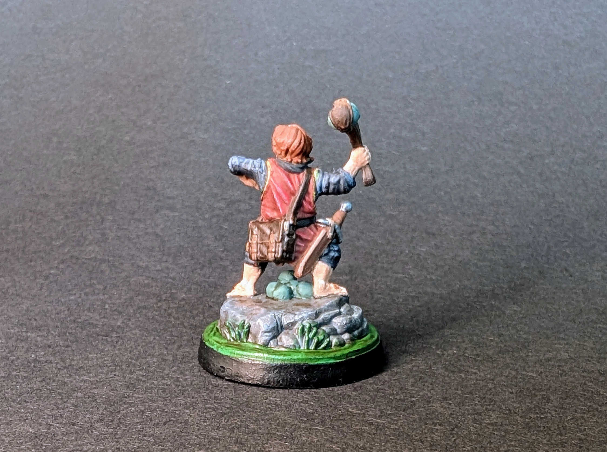

# Niziołek
<small>Czytaj w innym języku: [:gb:](https://paint-h3.qwrtln.nl/posts/2025/02/halfling/) [:ru:](https://ru.paint-h3.qwrtln.nl/posts/2025/02/полурослик/)</small>

Mała, ale wymagająca figurka do malowania.

  

<!--more-->

  

    
  

  

    
  

Kliknij, aby zobaczyć wideo z rozpakowywania

  <video width="1280" height="720" controls preload="none">
    <source src="/assets/videos/halfling.webm" type="video/webm">
  </video>

Wszystkie detale są namalowane całkiem dobrze. Twarz, z drugiej strony, jest w zupełnie innej lidze, której moje umiejętności nie dorównują. Oczy oczywiście mogłyby być lepsze, ale wolę zostawić je takimi, jakie są, żebym mógł porównać je z moimi przyszłymi malowaniami i zobaczyć postęp.

Zobacz Niziołki na [Wiki](https://homm3bg.wiki/pl/units/halflings).
