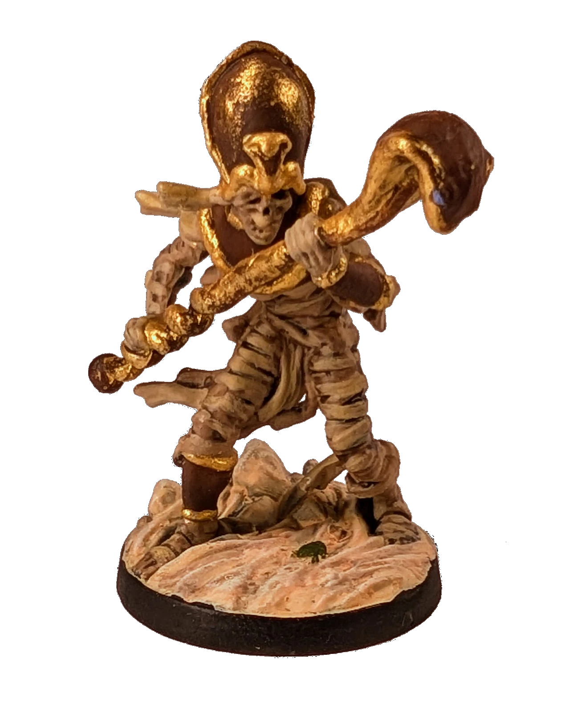
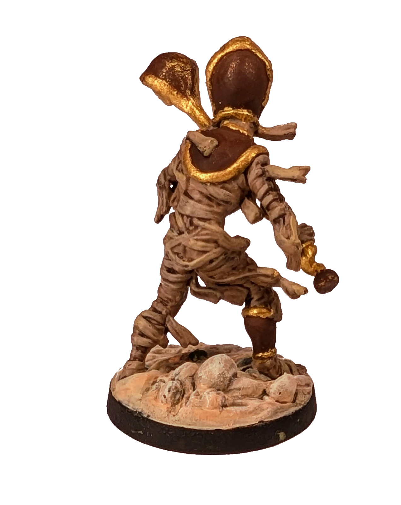

# Mumia
<small>Czytaj w innym języku: [:gb:](https://paint-h3.qwrtln.nl/posts/2025/02/mummy/) [:ru:](https://ru.paint-h3.qwrtln.nl/posts/2025/02/мумия/)</small>

Malowanie tej figurki przypomniało mi [Eddiego](https://pl.wikipedia.org/wiki/Eddie_(Iron_Maiden)), maskotkę Iron Maiden z albumu Powerslave.

  

<!--more-->

  

    
  

  

    
  

Kliknij, aby zobaczyć wideo z rozpakowywania

  <video width="1280" height="720" controls preload="none">
    <source src="/assets/videos/mummy.webm" type="video/webm">
  </video>

Zobacz Mumie na [Wiki](https://homm3bg.wiki/pl/units/mummies).

Oświetlenie na tych zdjęciach ma żółtawy odcień z powodu eksperymentalnego ustawienia świateł. Z czasem będzie lepiej.

### Plan

Jak zwykle, zaczynam od podkładu zenitalnego:

 - Krótkie pryśnięcia czarnym sprayem dookoła figurki

 - 2-3 jeszcze krótsze pryśnięcia białym

 - Miejsca trudno dostępne dla pędzla stają się widoczne

/// caption
Nauczyłem się oszczędnie i skutecznie pryskać sprayem
///

Grafika karty wykazuje wyraźne podobieństwo do starożytnego Egiptu i faraonów, wskazując piaskowe odcienie ze szlachetnymi akcentami.

/// caption
Początkowy dobór palety
///

/// caption
Mieszanie koloru bazowego na dostojne bandaże
///

### Proces

Rozpoczęcie od bandaży okazało się najprostsze.

/// caption
Kolor bazowy wymaga drugiej warstwy dla pełnego krycia
///

Wystające bandaże stanowią naturalne miejsca dla rozjaśnień. Względnie przyjazna tekstura wybacza niedokładności w ruchach pędzla.

Metaliczne elementy stanowiły główne wyzwanie, szczególnie berło. Choć kolory na obrazku wydają się podobne, dostępne farby wymagały nieco kreatywności:

 - Nałożyłem cienką warstwę złotego metaliku na brązową bazę, aby uzyskać subtelny połysk

 - Czysty złoty metalik na pozostałe metaliczne obszary

### Wniosek

Kluczowe lekcje:

 - Złoty metalik wymaga odpowiedniej warstwy bazowej dla właściwego krycia

 - Kolory na obrazku zasługują na bardziej dosłowną interpretację

 - Końcówka głowy węża wyglądałaby lepiej z białymi i pomarańczowymi rozjaśnieniami zamiast jednolitego brązu

 - Należy pamiętać: tworzymy iluzję rzeczywistości, a nie rzeczywistość
