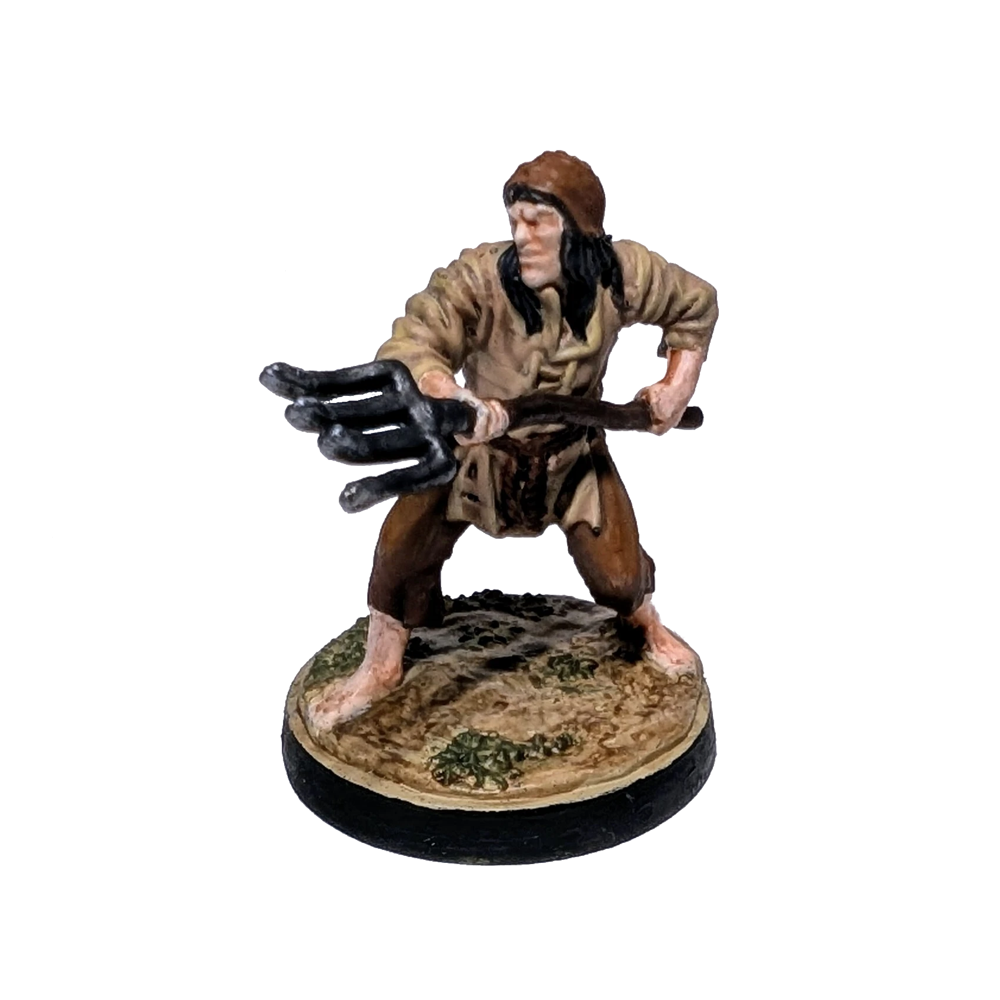

# Chłop
<small>Czytaj w innym języku: [:gb:](https://paint-h3.qwrtln.nl/posts/2024/11/peasant/) [:ru:](https://ru.paint-h3.qwrtln.nl/posts/2024/11/крестьянин/)</small>

Jak zostałem Pieterem Bruegelem na jeden wieczór. A niech ten chłop choć raz dobrze wygląda, zanim skończy w szkieletorni.

  

<!--more-->

Czas malowania: 4 h

Kliknij, aby zobaczyć wideo z rozpakowywania

  <video width="1280" height="720" controls preload="none">
    <source src="/assets/videos/peasant.webm" type="video/webm">
  </video>

Zobacz Chłopów na [Wiki](https://homm3bg.wiki/pl/units/peasants).

Po raz pierwszy postanowiłem nie trzymać się kolorów z karty, ponieważ były zbyt żywe. Prawdziwy chłop raczej nosiłby bardziej stonowane ubranie — fioletowe koszule raczej nie znalazłyby się w jego garderobie. Figurka ostatecznie otrzymała ziemiste, jesienne barwy.

### Proces

Użyłem brązu jako bazowego koloru dla spodni, wideł i czapki, ale to nie była najlepsza decyzja. Słuchając rady żony, rozjaśniłem spodnie i czapkę odrobiną pomarańczu, a uchwyt wideł odrobinę przyciemniłem.

Koszula i podstawka były zbyt podobne kolorystycznie, przez co figurka wyglądała zbyt jednolicie. Na szczęście było wystarczająco miejsc z trawą, którą pomalowałem metodą dry-brush kolorem, którego zwykle używam do malowania skóry zombie. Nawet ten stonowany odcień sprawił, że figurka wygląda bardziej żywo.

Widły zostały pomalowane metalicznym szarym kolorem (gunmetal) z srebrnymi krawędziami i lekkim dodatkiem czarnego tuszu, żeby stonować połysk. Aby nadać chłopu bardziej zabrudzony wygląd, użyłem rozcieńczonej farby kontrastowej Dreadful Visage jako wash.

### Wniosek

Moja ręka powoli przestaje drżeć. Oby uspokiła się całkiem, zanim skończą mi się łatwe figurki.
