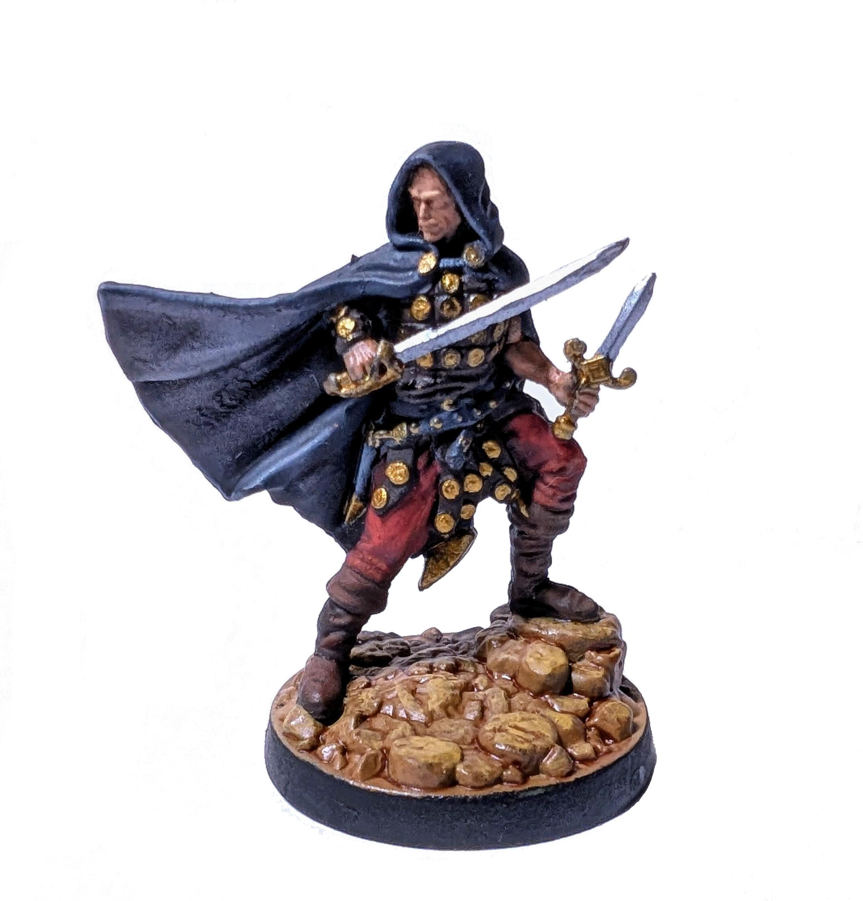
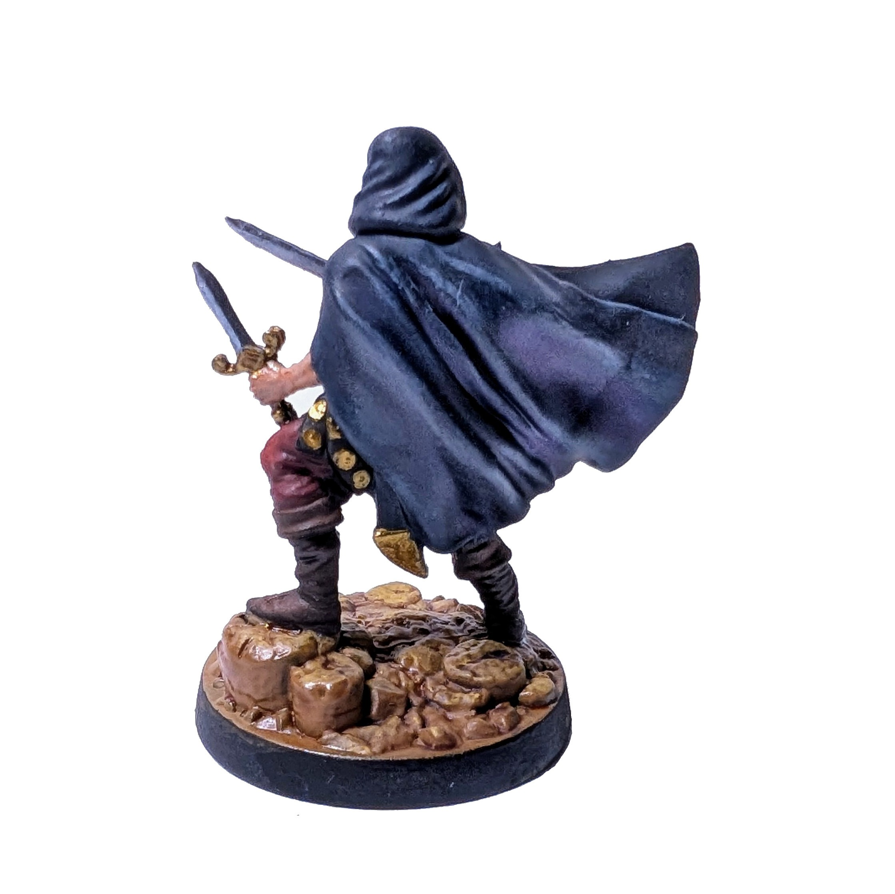

# Rozbójnik

Zacząłem od malowania neutralnych jednostek, aby się podszkolić.

  

Moja pierwsza pomalowana herosowa figurka. Na ogół jestem zadowolony z rezultatu. W szczególności podobają mi się cienie i rozjaśnienia na pelerynie, butach, spodniach, a nawet na twarzy. Widać jednak, że przy metalicznych detalach ręka początkującego jeszcze trochę drży. Podstawka też wyszła zbyt błyszcząca – pewnie przez nadużycie *wash*a.

Czas malowania: 5 h

Zobacz Rozbójników na [Wiki](https://homm3bg.wiki/pl/units/rogues).

Kliknij, aby zobaczyć wideo z rozpakowywania

  <iframe width="1280" height="720" src="https://www.youtube-nocookie.com/embed/RCvJ-YIeEgY?start=1935&end=1942&mute=1" frameborder="0" allowfullscreen></iframe>

