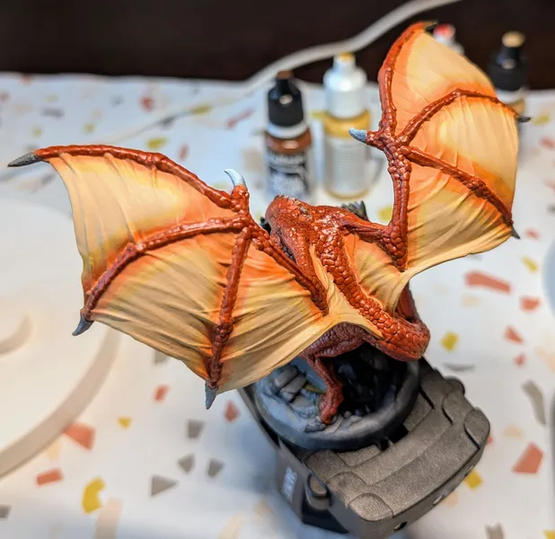
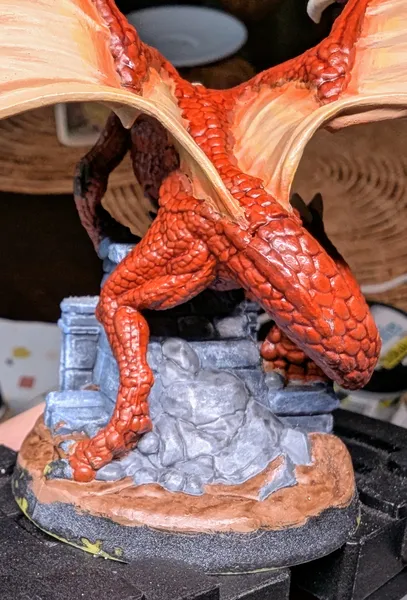
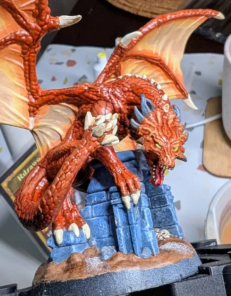

# Rdzawy Smok
<small>Czytaj w innym języku: [:gb:](https://paint-h3.qwrtln.nl/posts/2025/02/rust-dragon/) [:ru:](https://ru.paint-h3.qwrtln.nl/posts/2025/02/ржавый-дракон/)</small>

Rdzawe Smoki to trzecia najsilniejsza jednostka w grze wideo. Ich miejsce zostało zamienione z Kryształowymi Smokami w wersji planszowej.

    

<!--more-->

  

    
  

  

    
  

Kliknij, aby zobaczyć wideo z rozpakowywania

  <video width="1280" height="720" controls preload="none">
    <source src="/assets/videos/rust-dragon.webm" type="video/webm">
  </video>

Zobacz Rdzawe Smoki na [Wiki](https://homm3bg.wiki/pl/units/rust_dragons).

### Plan

Ta figurka jest znacznie większa niż większość pozostałych, więc wymaga zindywidualizowanego podejścia. Najpierw pokryję duże obszary tego samego koloru używając pędzla typu 'koci jęzk', a następnie przejdę do szczegółów.

### Proces

Patrząc na obrazek na karcie, smok ma pomarańczowe łuski. Mieszanka pomarańczowego z odrobiną brązowego powinna dać dobry kolor bazowy.

#### Łuski

Pokryłem całe ciało smoka używając dużego pędzla typu 'koci język'.

/// caption
Kolor jest słaby, będzie wymagał kilku warstw.
///

Nałóż tyle warstw, ile potrzeba do pełnego krycia.

/// caption
Kilka warstw później.
///

Zakończ odpowiednim wash'em, aby przyciemnić zagłębienia między łuskami.

/// caption
Wash Reikland Fleshshade robi swoje.
///

#### Skrzydła

Skrzydła potrzebują jaśniejszego koloru z gradientowymi przejściami wokół struktury kostnej. Najpierw pokryłem obszary nie przylegające bezpośrednio do ciała smoka.

/// caption
Warstwa bazowa na skrzydłach.
///

/// caption
Więcej warstw z ciemniejszymi krawędziami.
///

Na tym etapie zdałem sobie sprawę, że lepiej byłoby pokryć całe skrzydła tym samym kolorem i użyć glaze'a wokół struktury kostnej. Jednak nie wszystko stracone. *Highlighty* nadadzą skrzydłom nieco objętości, a przejścia nadal można wygładzić.

/// caption
Początkowe highlighty na skrzydłach.
///

/// caption
Wewnętrzne highlighty.
///

#### Pazury

Pazury są stosunkowo łatwe do malowania. Dodam ślady zębu czasu i highlight na późniejszym etapie.

/// caption
Zostawiłem głowę niepomalowaną, aby zająć się nią później.
///

#### Podstawka

Podstawa tej miniatury jest dość złożona. Na obrazku karty znajduje się konstrukcja przypominająca budynek, ziemia, kamienie, czaszki i śnieg. Zacząłem od budynku.

/// caption
Nałożyłem szary z odrobiną niebieskiego, błękitny wokół krawędzi, i dry-brush bielą dla tekstury.
///

/// caption
Obie strony wymagają starannego dry-brusha.
///

/// caption
Kamienie z tyłu zostały pomalowane bez niebieskiego odcienia.
///

Dla podłoża wybrałem kolor przypominający błoto z płatami topniejącego śniegu. Do efektu śniegu użyłem Ice Sparkles od AK.

/// caption
Ziemia z płatami topniejącego śniegu.
///

/// caption
Czaszki niefortunnych poszukiwaczy przygód w środku.
///

#### Łeb

Łeb to najważniejszy punkt miniatury, więc jego detale i highlighty powinny być najbardziej wyraziste. Starannie pomalowałem pysk bestii, nałożyłem najmocniejsze highlighty i dodałem efekt świecenia do oczu.

/// caption
Pysk ze świecącymi oczami.
///

Na końcu pomalowałem kolce na głowie. Efekt postarzenia uzyskałem przy pomocy wash Agrax Earthshade, który następnie nałożyłem na wszystkie pozostałe szpony.

/// caption
Postarzałe kolce dopełniają miniaturę.
///

### Wniosek

Kluczowe lekcje:

 - Używaj pędzla typu 'koci język' do dużych powierzchni, aby zaoszczędzić czas

 - Malowanie oczu jest wykonalne przy odpowiednim pędzlu

 - Tworzenie przejść gradientowych jest łatwiejsze przy użyciu *glaze* niż ręcznie

 - Żona-projektantka to złoto, ale przyjaciele pozwalający wypróbować sprzęt, którego jeszcze nie kupiłeś, to srebro
