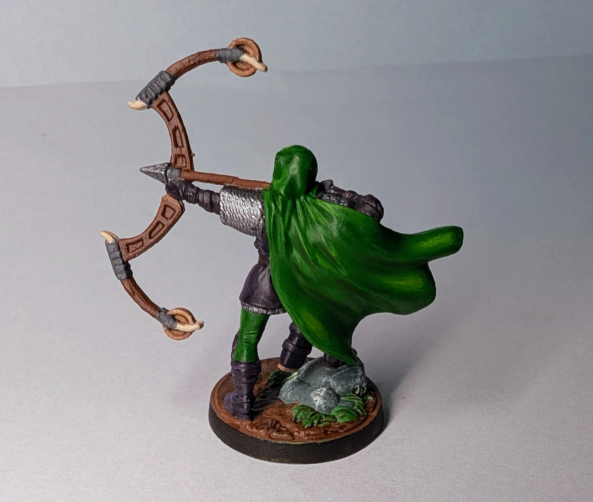
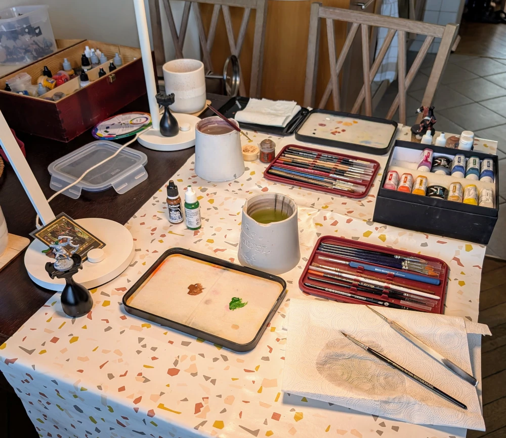

# Strzelec
<small>Czytaj w innym języku: [:gb:](https://paint-h3.qwrtln.nl/posts/2025/03/sharpshooter/) [:ru:](https://ru.paint-h3.qwrtln.nl/posts/2025/03/снайпер/)</small>

Okazała peleryna to zawsze przyjemność do malowania.

  

<!--more-->

  

    
  

  

    
    
  

Kliknij, aby zobaczyć wideo z rozpakowywania

  <video width="1280" height="720" controls preload="none">
    <source src="/assets/videos/sharpshooter.webm" type="video/webm">
  </video>

Muszę wycofać się z moich wcześniejszych stwierdzeń dotyczących nieprzydatności tutoriali z YouTube'a. [Poradnik Vince'a Venturelli na temat highlightów](https://youtu.be/W8uCKcF3aUc) jest niesamowicie pomocny. Kluczowy wniosek: malujemy światło, a nie rzeczywiste kolory.

### Proces

Zacznijmy od porady dotyczącej motywacji: o wiele trudniej jest prokrastynować, gdy malujesz z przyjaciółmi.

/// caption
Prowizoryczny warsztat malarski dla dwóch osób na kuchennym stole.
///

Aby szybko zrobić postęp, najpierw maluj duże powierzchnie dużym pędzlem. Peleryna i łuk to oczywiste wybory (bazowy brąz i bazowa zieleń). Reszta to gun metal na kolczugę, oraz czarny + fiolet na skórzane ubrania. Zastanawiam się, czy średniowieczni strzelcy naprawdę ubierali się tak stylowo.

/// caption
Te małe szczegóły pozostałe do pomalowania są dość czasochłonne.
///

/// caption
Warstwy bazowe gotowe. Widzisz ten kubek w tle? Teraz jest złoty, ha-ha.
///

Położywszy warstwy bazowe, przeszedłem do rozjaśnień używając pomarańczowego na brązowym, żółtego na zielonym, fioletowego na czarnym i srebrnego na gun metalu. Tym razem oszczędnie użyłem washa: tylko na podstawce i w zagłębieniach łuku (które w rzeczywistości byłyby otworami). Należy pamiętać też o dry-brushu na kamieniach. Ta technika jest tak świetna, że powinna jej zakazać.

### Wniosek

Kluczowe lekcje:

 - Obejrzyj [film Vince'a](https://youtu.be/W8uCKcF3aUc), jeśli jeszcze tego nie zrobiłeś. Naprawdę warto. To malarz figurek najwyższej klasy.

 - Ustawianie figurki pod silnym strumieniem światła jest bardzo pomocne. Można zobaczyć, gdzie powinny znaleźć się highlight'y i cienie.

 - Zrób przysługę znajomemu, który dawno nie malował, i zaproś go na wspólną sesję malowania.
