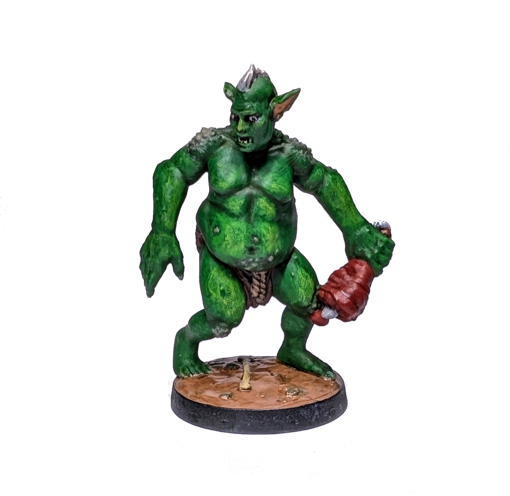
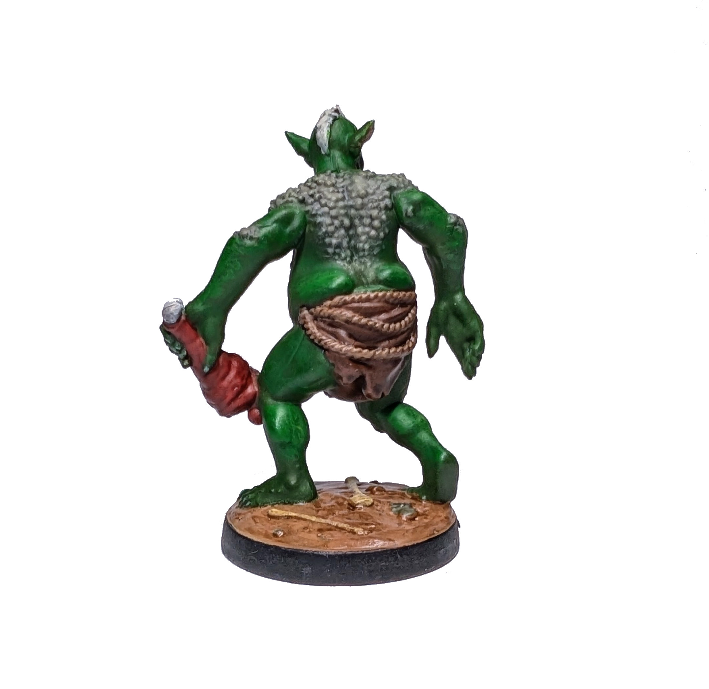

# Troll

Druga neutralna jednostka.

  

Podobno zieloną skórę łatwiej jest namalować niż ludzką. No cóż, bąble na skórze okazały się nie takie łatwe (wykonane chwiejnym *dry-brushing*iem). Niemniej jednak żółtawe rozjaśnienia wyszły przyzwoicie. To także moje pierwsze podejście do malowania detali twarzy, takich jak źrenice czy zęby. Cieszy mnie, że udały się przy pierewszym podejściu.

Czas malowania: 7 h

Zobacz Trolle na [Wiki](https://homm3bg.wiki/pl/units/trolls).

Kliknij, aby zobaczyć wideo z rozpakowywania

  <iframe width="1280" height="720" src="https://www.youtube-nocookie.com/embed/RCvJ-YIeEgY?start=1972&end=1979&mute=1" frameborder="0" allowfullscreen></iframe>

